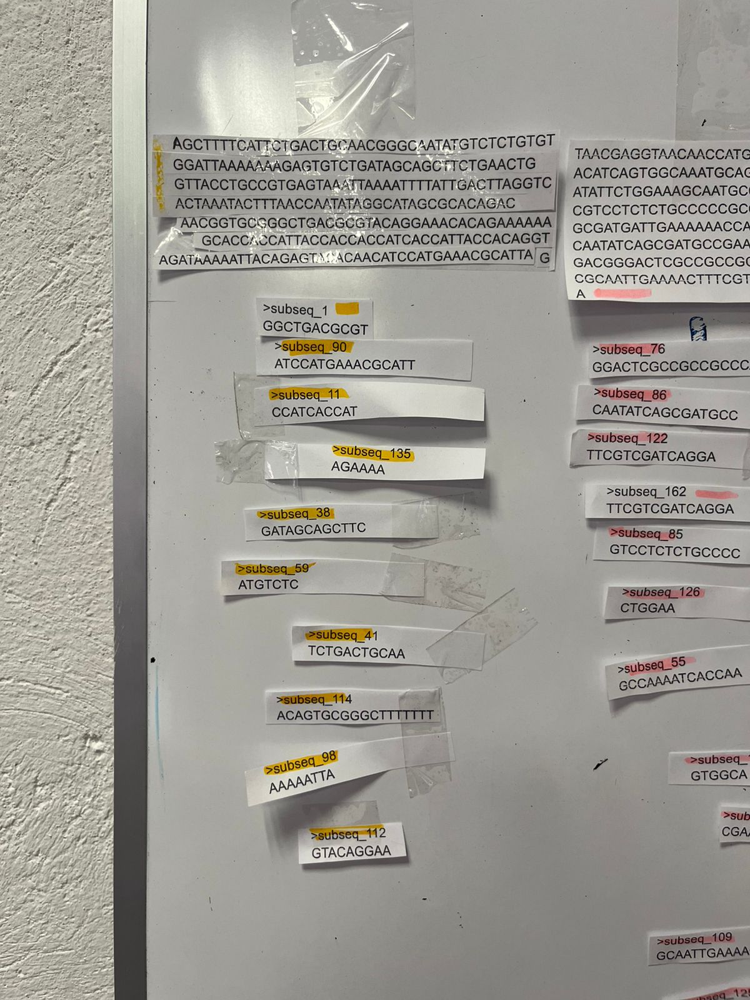
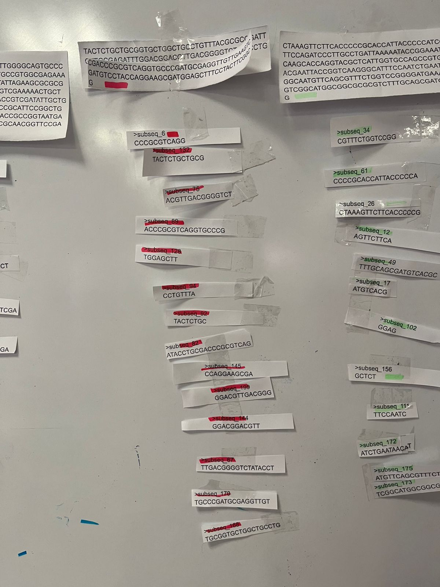
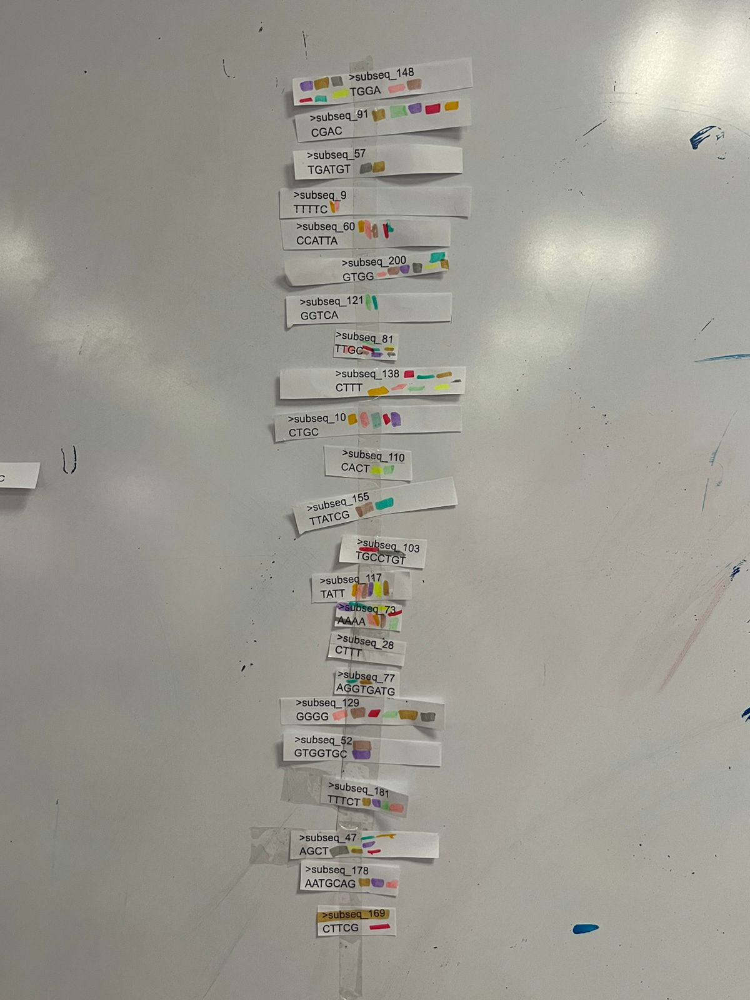
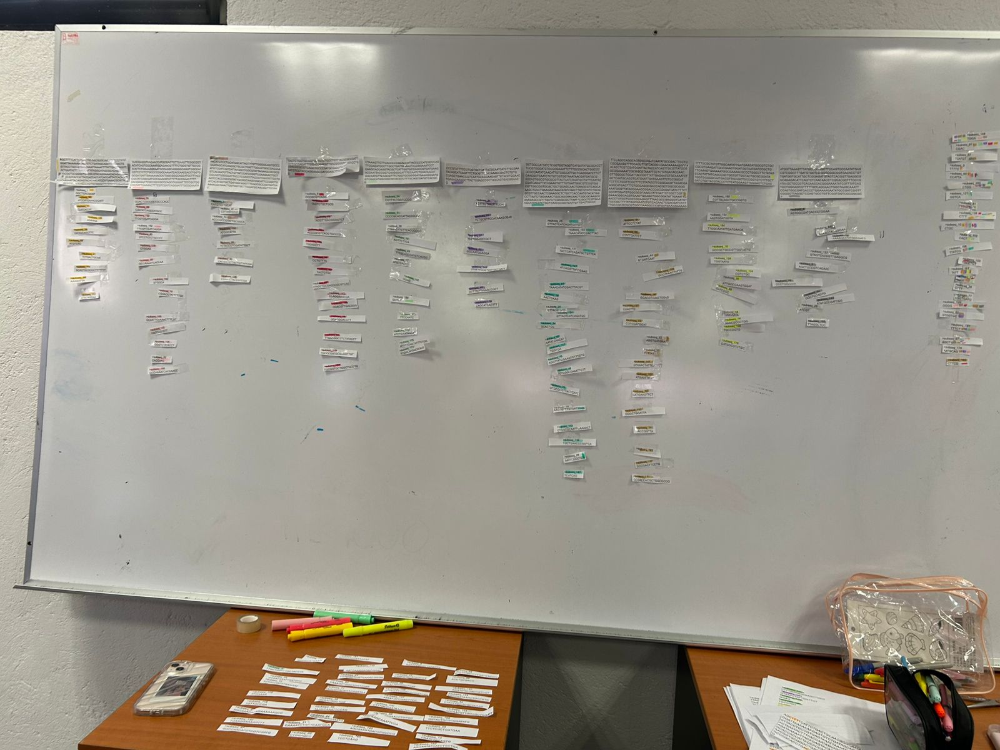

# **Introducción** 
En esta práctica se realizó un ejercicio manual de mapeo de secuencias de RNA contra un conjunto de reads impresos. Se comparó la eficiencia de este método con el método que podríamos utilizar en R. 

### **Materiales y métodos** 
1. Hojas con secuencias de los genes
2. Hojas con las subsecuencias
3. Marcadores de distintos colores
4. Cinta adhesiva

### **Procedimiento manual**
1. Se recibieron hojas impresas con secuencias. 
2. Se identificaron las subsecuencias dentro de los reads.
3. Se contó la frecuencia de cada subsecuencia. 

### **Resultados**

```{r, echo=FALSE, out.width="65%", fig.align="center"}
figura1<- c("practica1rob.jpg")

knitr::include_graphics(figura1)
```

```{r, echo=FALSE, out.width="65%", fig.align="center"}
figura2<- c("practica2rob.jpg")

knitr::include_graphics(figura2)
```

```{r, echo=FALSE, out.width="65%", fig.align="center"}
figura3<- c("practica3rob.jpg")

knitr::include_graphics(figura3)
```

```{r, echo=FALSE, out.width="65%", fig.align="center"}
figura4<- c("final.jpg")

knitr::include_graphics(figura4)
```

{width=65% height=65%}


{width=65% height=65%}


{width=65% height=65%}




### Ejemplo de un script en R 
Este es un ejemplo básico para hacer una tabla de abundancia de el pdf que nos proporcionaron. Pero no pudimos poner todas las secuencias, solo pusimos el primer párrafo y seleccionamos pocas subsecuencias 

```{r message=FALSE, warning=FALSE}
library(Biostrings)

# Secuencias de RNA en formato DNAStringSet
secuencias <- DNAStringSet(c("AGCTTTTCATTCTGACTGCAACGGGCAATATGTCTCTGTGT",
                             "GGATTAAAAAAAGAGTGTCTGATAGCAGCTTCTGAACTG",
                             "GTTACCTGCCGTGAGTAAATTAAAATTTTATTGACTTAGGTC",
                             "ACTAAATACTTTAACCAATATAGGCATAGCGCACAGAC",
                             "AGATAAAAATTACAGAGTACACAACATCCATGAAACGCATTA",
                             "GCACCACCATTACCACCACCATCACCATTACCACAGGT",
                             "AACGGTGCGGGCTGACGCGTACAGGAAACACAGAAAAAA",
                             "GCCCGCACCTGACAGTGCGGGCTTTTTTTTTCGACCAAAGG"))

# Subsecuecias a buscar
subseqs <- c("GGCTGACGCGT", "CATGTCCTGCAT", "TTGCTGATCTGCTACGTA", "AGTGGCGATGACCCTGGAA",
             "AGGAAACACAGAAAAAAGCC", "CCCGCGTCAGG", "TGGGTAAGCAAATTCCA", "AGTTTTGCGCTATGTTG", "TTTTC", "CTGC", "CCATCACCAT", "AGTTCTTCA", "CAAATTCCAGTG", "AAACGCCCTGG", "GCCGCTGCCGTTGGTACTG", "CCCTGGAAAA")

# Contar la abundancia de cada subsecuencia
conteo <- sapply(subseqs, function(subseq) sum(vcountPattern(subseq, secuencias)))

# Crear tabla de abundancia
tabla_abundancia <- data.frame(Subsecuencia = names(conteo), Frecuencia = conteo)
print(tabla_abundancia)
```


### **Discusión**

#####  En la realización de la práctica se utilizaron marcadores de colores para identificar las secuencias de genes y de igual manera para las subsecuencias correspondientes. A lo largo del análisis realizado, nos percatamos de que varias de las subsecuencias proporcionadas no correspondían a ningún gen, esto es apreciable en la ***figura 4*** en donde dichas subsecuencias están en la mesa de madera debajo del pizarrón, por otro lado, hubo muchas secuencias más que coincidieron con la secuencia de varios genes ***(figura 3)***. Después de estos hallazgos fue reconocible un patrón, el cual se basó en que las subsecuencias con menor longitud tendían a aparecer en secuencias diferentes, mientras que las secuencias más largas aparecían solo en un gen.

##### Como se mencionó anteriormente, la longitud de las subsecuencias tenía influencia en la frecuencia en que estas estaban distribuidas en todas las secuencias de genes de manera que los reads más largos permiten un mapeo más preciso, pero requieren mayor tiempo de procesamiento, esto se reflejado en que las subsecuencias más largas coinciden en ser aquellas que solo están presentes en una sola secuencia de gen, por otro lado los reads más cortos pueden mapearse en múltiples posiciones de manera ágil, pero a la vez se generan ambigüedades ya que al ser fragmentos tan pequeños en comparación a aquellos que son de un único gen, pueden estar sobrelapados con las subsecuencias largas, generando confusión en el análisis ya que no se sabe que hacer con esas lecturas, descartarlas o mantenerlas.

##### La ***tabla 1*** es una simulación de lo que se realizó en la práctica y sus resultados ejemplifican los argumentos que hemos utilizado, los cuales son que las subsecuencias cortas van a aparecer con mayor frecuencia que las secuencias largas, esto es claro al ver los ejemplos de las subsecuencias *"CTGC"* y *TTTTC* las cuales de acuerdo a los resultados, están presentes dos veces, mientras que la mayoría no está dentro de la secuencia ni una sola vez. A pesar de ser una simulación limitada a una sola secuencia de referencia, sus resultados son de gran ayuda para ejemplificar de manera sencilla los resultados de esta práctica. 


### **Conclusión** 

##### La identificación manual de secuencias es factible, pero ineficiente debido a que hay un alto porcentaje de cometer errores por parte del analista, pasar por alto una letra o registrar subsecuencias válidas cuando estas están sobrelapadas con subsecuencias largas. Es por lo anterior que las herramientas computacionales como R permiten una cuantificación más precisa y rápida de la expresión génica evitando errores humanos en el procedimiento.